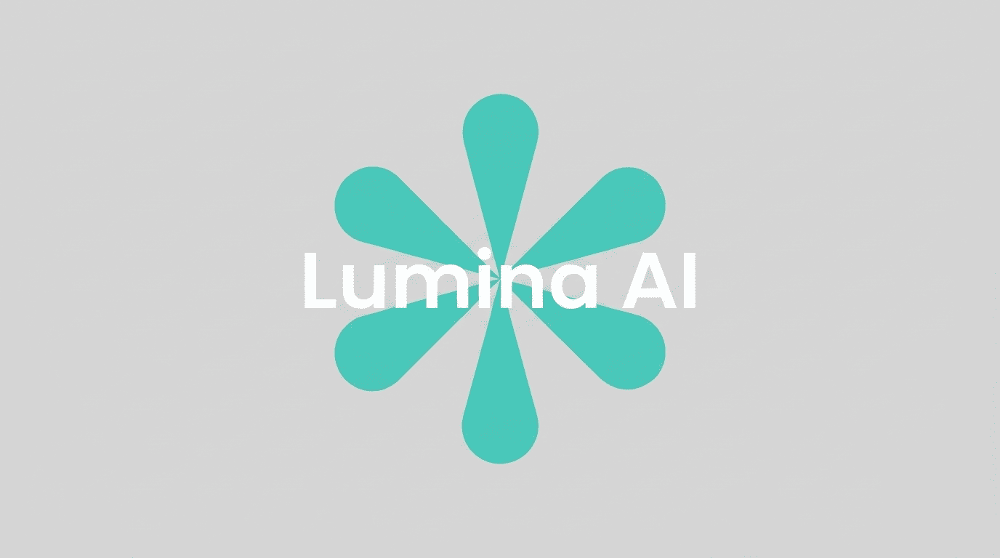

<p align="center">
	
</p>

<h1 align="center">Lumina AI</h1>

<p align="center">
	A calm, capable AI workspace for ideas that deserve a little more light.
</p>

<p align="center">
	<a href="https://lumina-ai-chat.vercel.app"></a>
</p>

<p align="center">
	
	
	
	
	
	
</p>

Lumina AI is a thoughtful, fast AI chat experience. It combines streaming responses, persistent chat history, markdown rendering, and a focused interface. Sign in, start a conversation, and pick it up again whenever the next idea arrives.

## Try Lumina

The deployed app is available at **[lumina-ai-chat.vercel.app](https://lumina-ai-chat.vercel.app)**.

## Run It Locally

### 1. Clone and install

```bash
git clone https://github.com/towfeeqkhan/Lumina-AI.git
cd Lumina-AI
npm install
```

### 2. Add environment variables

Create an `.env` or `.env.local` file in the project root and add your Groq, Neon, and Clerk credentials:

```env
GROQ_API_KEY=
DATABASE_URL=
NEXT_PUBLIC_CLERK_PUBLISHABLE_KEY=
CLERK_SECRET_KEY=
```

### 3. Prepare the database

Generate SQL migrations from the Drizzle schema, then apply them to your Neon database:

```bash
npx drizzle-kit generate
npx drizzle-kit migrate
```

### 4. Start the app

```bash
npm run dev
```

Open [http://localhost:3000](http://localhost:3000) in your browser.

## Change The AI Provider

The model configuration lives in [`lib/ai.ts`](./lib/ai.ts). Install the provider package you want to use, then replace the model import and configuration there. The application uses the Vercel AI SDK, so providers such as OpenAI, Anthropic, and Google can be swapped in without changing the chat interface.

The default configuration uses Groq:

```ts
import { groq } from "@ai-sdk/groq";

export const model = groq("openai/gpt-oss-120b");
```

You can switch to models such as GPT-5.6-sol, Claude Opus 4.8, or Gemini 3.7 Flash when those models are available through your chosen provider and account.

## Contributing

Contributions are always welcome. If you have an idea, spot a bug, or want to add a feature, feel free to open an issue or start a pull request. Small improvements count too.

## Connect

Built by [Towfeeq Khan](https://www.linkedin.com/in/towfeeqkhan).
